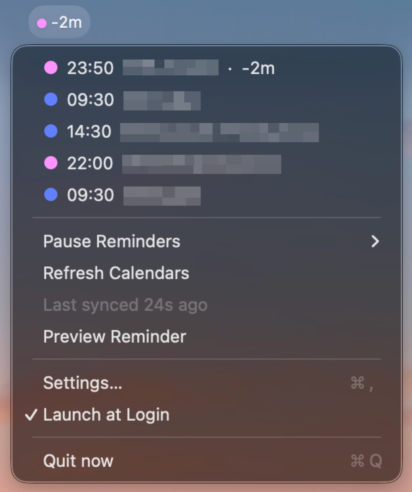

# now

[](https://github.com/BoThomas/now/releases/latest)
[](https://github.com/BoThomas/now/blob/main/LICENSE)

Native macOS menu bar app for meeting reminders, inspired by [inyourface.app](https://inyourface.app).

Add the shared iCal (ICS) links of your calendars — or connect Apple Calendar directly — and `now` takes over the whole screen right before a meeting starts, using a big one-click join button when it finds a meeting link!

<table>
  <tr>
    <td align="center"></td>
    <td align="center"></td>
  </tr>
</table>

## Download

<p>
  <a href="https://github.com/BoThomas/now/releases/latest"></a>
</p>

Grab `now-vX.Y.Z.zip` from the [latest release](https://github.com/BoThomas/now/releases/latest), unzip, and move `now.app` to /Applications.

> Release builds are signed with a stable self-signed identity (not notarized with Apple), so macOS Gatekeeper shows a warning on first launch. Any one of these fixes it — only needed once:
>
> 1. Click **Done** in the warning dialog, then open **System Settings → Privacy & Security**, scroll down, and click **Open Anyway**.
> 2. Right-click `now.app` → **Open** → **Open**.
> 3. In Terminal: `xattr -cr /Applications/now.app`

## Features

**Reminders**
- Fullscreen takeover N seconds/minutes before an event starts (presets incl. Just in time + fine tune)
- One-click **Join** when a meeting link is found — detected in `CONFERENCE`/`URL` properties, location, notes, Outlook HTML descriptions, attachments, even the title (Zoom, Google Meet, Teams, WebEx, GoTo, RingCentral, Jitsi, … or any URL — native `zoommtg://` and `msteams:` links are converted automatically)
- Live countdown, Snooze 1 min (re-appears even after the meeting has started), Close
- Keyboard: `esc` close · `return` join · `s` snooze · `1`–`9` join a specific meeting when several appear
- Optional local meeting detection prevents new reminders from interrupting an active call; browser calls are a separate best-effort opt-in. No audio is recorded.

**Menu bar**
- Live countdown to the next meeting — including late ones (`-3m`), for as long as you configure
- Upcoming event list (click to join), pause reminders (1 h / 3 h / until tomorrow 9:00 / indefinitely), refresh, reminder preview

**Calendars**
- Any shared iCal/ICS feed: Google secret address, Outlook publish-to-web, iCloud webcal, church.tools, …
- **Apple Calendar integration:** use any calendar configured in Calendar.app — iCloud, Google, Exchange/Outlook, Yahoo, generic CalDAV, "On My Mac" — with no links at all. Grant access once in Settings → *Apple Calendars*. Native calendars update near-instantly (they react to Calendar.app changes live, instead of waiting for the next feed poll) and recurring events, cancellations and moved instances just work.
- Recurring events: RRULE with daily/weekly/monthly/yearly frequency, INTERVAL, COUNT, UNTIL, BYDAY, EXDATE, and moved or cancelled instances
- Per-calendar color and upcoming-event list with join links, sync status and errors, refresh interval (5–60 min) plus refresh on wake
- Option to hide events you've declined

**Settings** — lead time presets, 13 system alert sounds with preview, late-meeting visibility, menu bar countdown toggle, Launch at Login, reminder preview.

### Meeting detection notes

- Meeting detection reads local CoreAudio process metadata only. It does not record audio and does not need microphone permission.
- Native meeting apps can be identified by process. For browser calls, macOS identifies the browser but not the responsible tab or website, so browser detection is off by default and may mistake recording or dictation for a meeting.
- The option requires process-level audio metadata available on newer macOS versions. If the capability check fails, `now` leaves the option off and continues showing reminders normally.

### Apple Calendar permission notes

- Permission is only requested when you click **Grant Access…** in Settings → *Apple Calendars* — never at launch. Calendar data never leaves your Mac.
- If you later deny it, re-enable in **System Settings → Privacy & Security → Calendars**.
- The app is signed with a stable self-signed identity ("now Developer"), and macOS keys the Calendar grant to the code signature — that identity stays the same across releases, so the grant survives app updates. Local dev builds made *without* that identity fall back to ad-hoc signing and will be re-asked once per build. If a grant seems stuck, run `tccutil reset Calendars com.thomasboch.now` and grant again.
- If you enable the same calendar twice (as an ICS link *and* via Apple Calendar), its events will show up twice — keep one of the two.
- `now` reads calendar events only; you may also see Calendar.app's own notifications for the same meetings — turn those off per-calendar in Calendar.app if you get double reminders.

## Building from source

Requires Xcode Command Line Tools with a macOS 15 or later SDK (the build uses the active SDK reported by `xcrun`; override with `SDK_PATH` if needed).

```bash
./build-app.sh
```

Builds `outputs/now.app` and `outputs/now.zip`. macOS 13+, arm64.

### Development tools

```bash
./outputs/now.app/Contents/MacOS/now --selftest            # parser unit tests
./outputs/now.app/Contents/MacOS/now --parse <url-or-file> # inspect any iCal feed
./outputs/now.app/Contents/MacOS/now --native [list]       # inspect Apple Calendar access
./outputs/now.app/Contents/MacOS/now --meeting            # inspect active meeting audio metadata
./release.sh --dry-run                                     # release pipeline check
```

See [AGENTS.md](AGENTS.md) for development notes and the release workflow.

## Author & License

[Thomas Boch](https://thomasboch.com) · [GitHub](https://github.com/BoThomas)

MIT — see [LICENSE](LICENSE).
