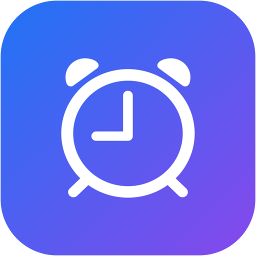
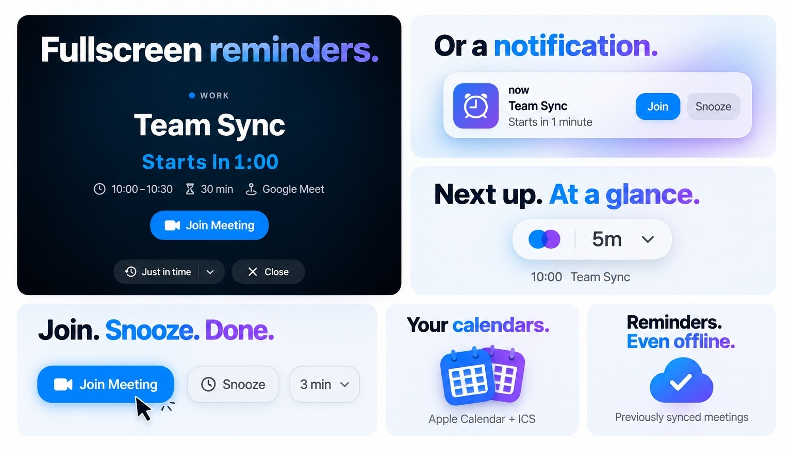
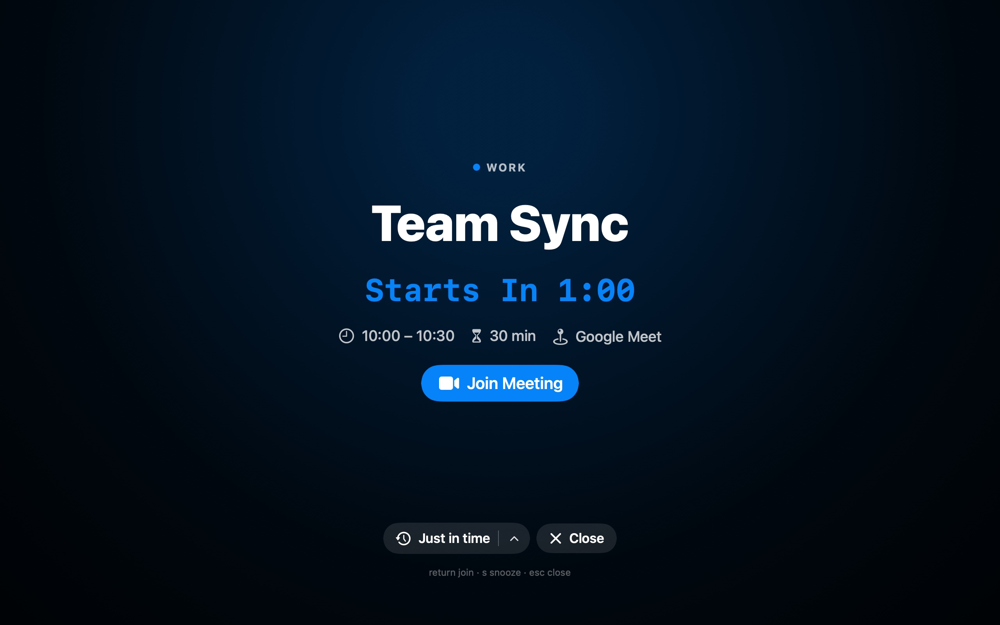
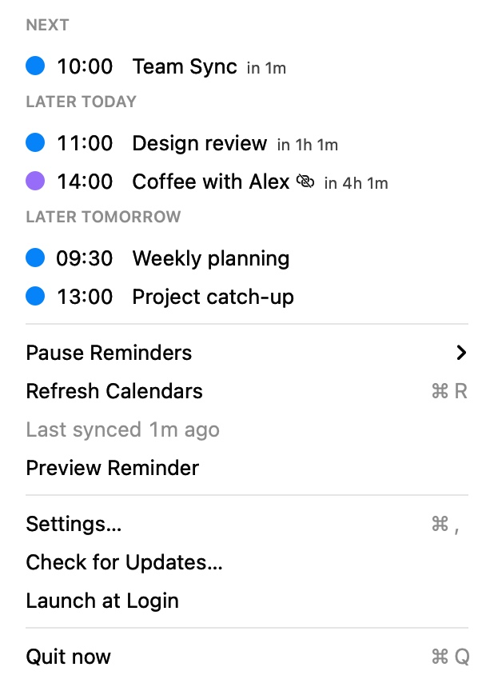

# now

Native macOS meeting reminders that live in your menu bar.

Connect Apple Calendar or an iCal/ICS feed. Get a fullscreen reminder or macOS notification, then join your meeting with a click.

## Download

  

**Apple Silicon · macOS 13 or later**

Grab `now-vX.Y.Z.zip` from the [latest release](https://github.com/BoThomas/now/releases/latest), unzip, and move `now.app` to `/Applications`.

> Release builds are signed but not notarized. If macOS blocks the first launch, use one of these options:
>
> - **System Settings → Privacy & Security → Open Anyway** ([Apple’s instructions](https://support.apple.com/102445)).
> - Or, right-click `now.app` → **Open** → **Open** (if available on your macOS version).
> - Or, run `xattr -dr com.apple.quarantine /Applications/now.app` in Terminal, then open the app again.

## Get started

1. Open now and choose your reminder style and timing in the setup assistant.
2. In Settings, add an iCal/ICS link or grant Apple Calendar access and select your calendars.
3. Try a reminder preview, then leave now running in your menu bar.

Launch at Login and automatic updates are optional. Upgrades keep your calendars and preferences.

<strong>See the app</strong>

<table>
  <tr>
    <td align="center"></td>
    <td align="center"></td>
  </tr>
</table>

## Learn more

- [Quick guide](docs/guide.md)
- [Changelog](CHANGELOG.md)
- [Building and testing from source](docs/development.md)

## Author & License

[Thomas Boch](https://thomasboch.com) · [GitHub](https://github.com/BoThomas) · [MIT license](LICENSE)

Inspired by [inyourface.app](https://inyourface.app).
