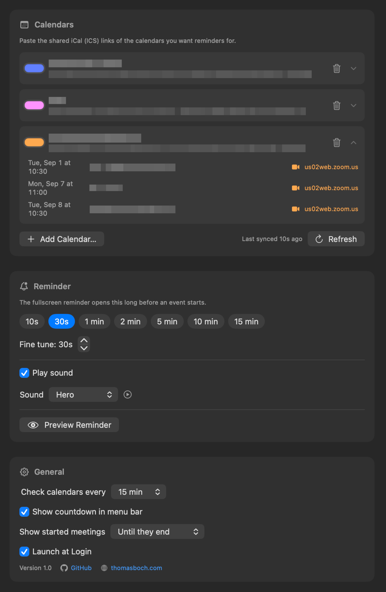

# now

[](https://github.com/BoThomas/now/releases/latest)
[](https://github.com/BoThomas/now/blob/main/LICENSE)

Native macOS menu bar app for meeting reminders, inspired by [inyourface.app](https://inyourface.app). Add the shared iCal (ICS) links of your calendars and `now` takes over the whole screen right before a meeting starts — with a big one-click join button when it finds a meeting link.

<table>
  <tr>
    <td></td>
    <td></td>
    <td></td>
  </tr>
</table>

## Download

<p>
  <a href="https://github.com/BoThomas/now/releases/latest"></a>
  <a href="https://thomasboch.com"></a>
</p>

Grab `now-vX.Y.Z.zip` from the [latest release](https://github.com/BoThomas/now/releases/latest), unzip, and move `now.app` to /Applications.

> The app is ad-hoc signed, so macOS quarantines downloaded copies. If it refuses to open: right-click → **Open**, or run `xattr -d com.apple.quarantine /Applications/now.app`.

## Features

**Reminders**
- Fullscreen takeover N seconds/minutes before an event starts (presets + fine tune)
- One-click **Join** when a meeting link is found — detected in `CONFERENCE`/`URL` properties, location and notes (Zoom, Google Meet, Teams, WebEx, GoTo, Jitsi, … or any URL)
- Live countdown, Snooze 1 min (re-appears even after the meeting has started), Close
- Keyboard: `esc` close · `return` join · `s` snooze — multiple simultaneous meetings in one alert

**Menu bar**
- Live countdown to the next meeting — including late ones (`-3m`), for as long as you configure
- Upcoming event list (click to join), pause reminders (1 h / 3 h / until tomorrow 9:00 / indefinitely), refresh, reminder preview

**Calendars**
- Any shared iCal/ICS feed: Google secret address, Outlook publish-to-web, iCloud webcal, church.tools, …
- Recurring events: RRULE with daily/weekly/monthly/yearly frequency, INTERVAL, COUNT, UNTIL, BYDAY, EXDATE, and moved or cancelled instances
- Per-calendar color and upcoming-event list with join links, sync status and errors, refresh interval (5–60 min) plus refresh on wake

**Settings** — lead time presets, 13 system alert sounds with preview, late-meeting visibility, menu bar countdown toggle, Launch at Login, reminder preview.

## Building from source

Requires Xcode Command Line Tools with a macOS 15.x SDK.

```bash
./build-app.sh
```

Builds `outputs/now.app` and `outputs/now.zip`. macOS 13+, arm64.

### Development tools

```bash
./outputs/now.app/Contents/MacOS/now --selftest            # parser unit tests
./outputs/now.app/Contents/MacOS/now --parse <url-or-file> # inspect any iCal feed
./release.sh --dry-run                                     # release pipeline check
```

See [AGENTS.md](AGENTS.md) for development notes and the release workflow.

## Author & License

[Thomas Boch](https://thomasboch.com) · [GitHub](https://github.com/BoThomas)

MIT — see [LICENSE](LICENSE).
